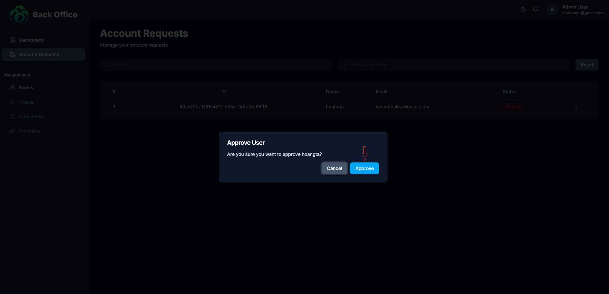

# Milestone 1: Hydra Hub Core System Development - Completion Report

**Milestone ID:** 1400060
**Project:** Hydra Hub (Fund14)
**Submission Date:** [2026-01-30]

---

## 1. Deployed System Access

**Public URLs:**
*   **Backoffice Demo (Admin):** [Backoffice Demo URL](https://demo-back-office.hydrahub.io.vn/)
*   **Backoffice Demo Api Docs (Admin):** [Backoffice Demo Api Docs URL](https://demo-back-office-api.hydrahub.io.vn/api-docs)
*   **Alpha Testing Environment:** [Link to Alpha Testing URL]()

**Demo Credentials:**
Reviewers can use the following credentials to verify role-based functionalities:

| Role | Email / Username | Password |
|------|------------------|----------|
| **Admin** | `admin@hydrahub.app` | `demoAdmin123` |
| **User** | `user@hydrahub.app` | `demoUser123` |

---

## 2. Demonstration Materials

### A. Screenshots

**1. User Registration and Login**
#### user registation

#### user registation

**2. Submitting Hydra Node Access Requests**

- After registering an account, an account activation request will be sent to the system. Once the account is approved, you can log in and start using the Hydra node.

**3. Admin Reviewing and Approving Requests**

**4. Real-time Node Allocation and Status Display**

---

## 3. Testing Evidence (QA Report)

**Summary of Results:**
The system has passed internal testing for core functionality, browser compatibility, and responsiveness.

**Test Matrix:**

| Test Category | Scope | Status |
|---------------|-------|--------|
| **Functional Tests** | Register/Login, Node Request Flow, RBAC Validation | **PASSED** |
| **Browser Compatibility** | Chrome v120+, Safari v17+ | **PASSED** |
| **Responsiveness** | Desktop (1920×1080), Mobile (375×812) | **PASSED** |

**Supporting Evidence:**
*   [Link to Full QA Test Report Document / PDF]

---

## 4. Documentation Package

**User Manual:**
*   [Link to Consumer Portal User Guide]

---

## Acceptance Criteria Checklist

Please verify that the following criteria have been met:

- [x] **1. User Account Management:** Consumers can create accounts, log in, and update profile info.
- [x] **2. Hydra Node Access Request:** Consumers can submit requests; admins review and respond.
- [x] **3. Admin Dashboard Monitoring:** Dashboard displays consumer list, pending requests, and node status.
- [x] **4. Node Allocation Control:** Allocating/revoking rights functions correctly.
- [x] **5. Role-Based Access Control (RBAC):** Admin features are restricted from Consumers.
- [x] **6. System Testing:** Passed UI functional tests, browser compatibility, and responsiveness.
- [x] **7. Backend Integration:** Full integration with PostgreSQL and API endpoints:
    *   `POST /api/auth/register` & `POST /api/auth/login`
    *   `POST /api/requests` & `GET /api/requests`
    *   `POST /api/admin/requests/:id`
    *   `GET /api/admin/nodes`
