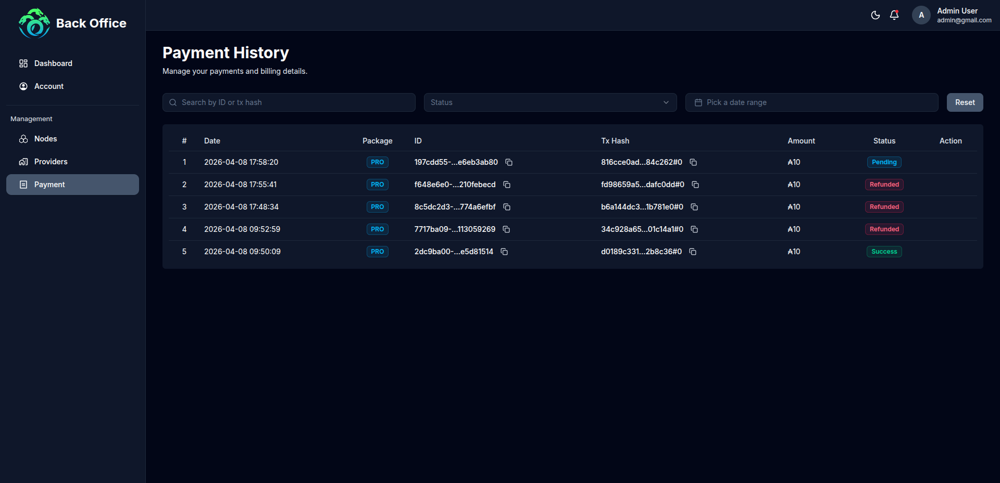

# Milestone 3: On-chain Payment Subscription - Completion Report

**Milestone ID:** 1400060
**Project:** Hydra Hub (Fund14)
**Submission Date:** 2026-04-08

---

## 1. Smart Contract Deployment Evidence

### A. Aiken Smart Contract Information

**Contract Name:** `timed_deposit` (Payment Subscription Validator)

**Deployed Network:** Cardano Pre-Production Testnet

| Field              | Value                                                             |
| ------------------ | ----------------------------------------------------------------- |
| **Script Hash**    | `41631ceb642272fbf20a2de0563b472f0d83cf78ca5c9b5708c94b9f`        |
| **Script Address** | `addr_test1wpqkx88tvs3897ljpgk7q43mguhsmq700r99ex6hpry5h8c3puxdp` |
| **Plutus Version** | V3                                                                |
| **Compiler**       | Aiken v1.1.21+42babe5                                             |

**Contract Parameters:**

| Parameter   | Value                                                      | Description                               |
| ----------- | ---------------------------------------------------------- | ----------------------------------------- |
| `recipient` | `909cbdd42115fb63f9de7d66a3cd03245bfec408945530101c2b4139` | Admin wallet PKH receiving payments       |
| `time_lock` | `86400000`                                                 | Dispute period in milliseconds (24 hours) |

**Compiled Blueprint:**

- [plutus.json](./ms3/payment-subscription/plutus.json)

**Source Code Repository:**

- [Aiken Validator Source](./ms3/payment-subscription/validators/timed_deposit.ak)

### B. Contract Logic Overview

The `timed_deposit` smart contract implements a time-locked payment system for subscription upgrades:

1. **Buy (Lock):** User locks ADA into the contract with datum containing:
   - `sender`: User's verification key hash
   - `deposit_time`: POSIX timestamp in milliseconds

2. **Refund:** Admin can refund the user's payment BEFORE the deadline (deposit_time + 24h):
   - Requires admin signature
   - Funds returned to original sender address

3. **Claim:** Admin claims the locked funds AFTER the deadline:
   - Requires admin signature
   - Funds transferred to admin (recipient) address
   - **Auto-Claim Feature:** System automatically checks and executes claim transactions after 24-hour dispute period expires via scheduled cron job

4. **ReclaimInvalid:** Rescue funds locked with invalid datum format:
   - Requires admin signature
   - Safety mechanism for malformed transactions

---

## 2. On-chain Transaction Evidence

### A. Transaction Hashes

All transactions are verifiable on the Cardano Pre-Production Testnet explorer.

| Operation      | Transaction Hash                                                   | Status       | Explorer Link                                                                                                                         |
| -------------- | ------------------------------------------------------------------ | ------------ | ------------------------------------------------------------------------------------------------------------------------------------- |
| **Buy (Lock)** | `d0189c3319aa1ff6296371d35b90ffc86eed0d309e7cacf748a456eaf32b8c36` | ✅ Confirmed | [View on CardanoScan](https://preprod.cardanoscan.io/transaction/d0189c3319aa1ff6296371d35b90ffc86eed0d309e7cacf748a456eaf32b8c36)    |
| **Refund**     | `0c9bff65be37bdc197c25d0eb94fc9c0160dda7c836003b31798a18e73037aca` | ✅ Confirmed | [View on CardanoScan](https://preprod.cardanoscan.io/transaction/0c9bff65be37bdc197c25d0eb94fc9c0160dda7c836003b31798a18e73037aca) |
| **Claim**      | `370df79ba57bf144decf05817539066c06b4809675880216049468f68725274c` | ✅ Confirmed | [View on CardanoScan](https://preprod.cardanoscan.io/transaction/370df79ba57bf144decf05817539066c06b4809675880216049468f68725274c)  |

### B. Transaction Details

#### Buy Transaction (Subscription Payment Lock)

```
User: addr_test1qz...user_address
Amount: 100 ADA
Datum: { sender: "user_pkh", deposit_time: 1712505600000 }
Script: addr_test1wpqkx88tvs3897ljpgk7q43mguhsmq700r99ex6hpry5h8c3puxdp
```

#### Refund Transaction (Admin Dispute Resolution)

```
Redeemer: Refund (index 0)
Validity: Before deadline (deposit_time + 86400000)
Recipient: Original sender address
Signer: Admin wallet (recipient param)
```

#### Claim Transaction (Admin Payment Collection)

```
Redeemer: Claim (index 1)
Validity: After deadline (deposit_time + 86400000)
Recipient: Admin wallet
Execution: Automatic via cron job (checked every hour)
Signer: Admin wallet (recipient param)
```

---

## 3. Demonstration Materials

### A. Video Demonstration

**Full Workflow Demo Video:** [https://youtu.be/8yuqklKH3Qk](https://youtu.be/8yuqklKH3Qk)

The video demonstrates the complete payment subscription workflow:

1. **Account Upgrade Flow:**
   - User initiates upgrade on Hydra Hub platform
   - User locks ADA payment to smart contract
   - Transaction confirmed on-chain
   - Account node creation limit upgraded

2. **Refund Flow (Dispute Period):**
   - Admin triggers refund within 24-hour dispute period
   - Refund transaction confirmed on blockchain
   - User receives funds back to original address

3. **Claim Flow (After Dispute Period):**
   - System automatically checks for expired payments (cron job runs every hour)
   - Auto-claim transaction submitted after 24-hour period expires
   - Claim transaction confirmed on blockchain
   - Funds transferred to admin wallet
   - Payment status updated to "Claimed" in database

### B. Screenshots

**1. Admin Dashboard - Payment Status**



*Dashboard hiển thị trạng thái các giao dịch thanh toán: Buy, Refund, và Claim với các transaction hash tương ứng.*

---

## 4. Testing Evidence (QA Report)

### A. Test Summary

| Test Category                  | Scope                                                          | Status    |
| ------------------------------ | -------------------------------------------------------------- | --------- |
| **Smart Contract Unit Tests**  | Aiken validator logic (Refund, Claim, ReclaimInvalid)          | ✅ PASSED |
| **On-chain Integration Tests** | Lock, Refund, Claim transactions on preprod                    | ✅ PASSED |
| **End-to-End Tests**           | Complete payment subscription workflow                         | ✅ PASSED |
| **Auto-Claim Tests**           | Scheduled cron job detection and automatic claim execution     | ✅ PASSED |
| **Security Tests**             | Authorization, time validation, datum verification             | ✅ PASSED |

### B. Test Case Results

| ID   | Test Case                      | Expected Result                                       | Status  |
| ---- | ------------------------------ | ----------------------------------------------------- | ------- |
| TC01 | Lock ADA to payment contract   | UTxO created at script address with valid datum       | ✅ Pass |
| TC02 | Refund before deadline         | Funds returned to sender, requires admin signature    | ✅ Pass |
| TC03 | Refund after deadline fails    | Transaction rejected due to time validation           | ✅ Pass |
| TC04 | Claim after deadline           | Funds transferred to admin, requires signature        | ✅ Pass |
| TC05 | Claim before deadline fails    | Transaction rejected due to time validation           | ✅ Pass |
| TC06 | Unauthorized refund fails      | Transaction rejected without admin signature          | ✅ Pass |
| TC07 | Unauthorized claim fails       | Transaction rejected without admin signature          | ✅ Pass |
| TC08 | ReclaimInvalid with bad datum  | Admin can rescue funds with invalid datum             | ✅ Pass |
| TC09 | Account upgrade after payment  | Node creation limit increased after lock confirmation | ✅ Pass |
| TC10 | Account downgrade after refund | Node creation limit reverted after refund             | ✅ Pass |
| TC11 | Auto-claim scheduler triggers  | Cron job detects expired payments automatically       | ✅ Pass |
| TC12 | Auto-claim executes correctly  | Automatic claim TX submitted after 24h                | ✅ Pass |
| TC13 | Auto-claim updates status      | Payment status changed to "Claimed" in database      | ✅ Pass |

**Supporting Evidence:**

- [Full QA Test Report (EN)](./ms3/qa-report/readme.md)
- [Full QA Test Report (VI)](./ms3/qa-report/readme-vi.md)

---

## 5. Documentation

### Technical Documentation

- [Aiken Contract Source](./ms3/payment-subscription/validators/timed_deposit.ak)
- [Contract Types](./ms3/payment-subscription/validators/types.ak)
- [Compiled Blueprint](./ms3/payment-subscription/plutus.json)
- [Contract Parameters](./ms3/payment-subscription/validators/params.json)

---

## 6. Acceptance Criteria Checklist

Please verify that the following criteria have been met:

- [x] **1. Smart Contract Development:** Aiken timed_deposit validator implemented with Refund, Claim, ReclaimInvalid actions.
- [x] **2. Contract Deployment:** Smart contract deployed to Cardano Pre-Production Testnet.
- [x] **3. Buy Transaction:** User can lock ADA to contract for subscription upgrade.
- [x] **4. Refund Mechanism:** Admin can refund user within 24-hour dispute period.
- [x] **5. Claim Mechanism:** Admin can claim funds after dispute period ends.
- [x] **6. Auto-Claim Feature:** System automatically checks and executes claim after 24-hour dispute period via scheduled cron job.
- [x] **7. Time Validation:** Contract enforces deadline correctly for refund/claim operations.
- [x] **8. Authorization:** All operations require proper signatures (admin for refund/claim).
- [x] **9. Platform Integration:** Payment status reflected in Hydra Hub account upgrade.
- [x] **10. Testing:** Unit tests, on-chain integration tests, and auto-claim tests passed.
- [x] **11. Documentation:** Technical documentation provided.

---

## 7. Links & Resources

| Resource             | Link                                                                                                                  |
| -------------------- | --------------------------------------------------------------------------------------------------------------------- |
| Hydra Hub Platform   | https://uat.hydrahub.io.vn                                                                                            |
| Admin Dashboard      | https://uat-back-office.hydrahub.io.vn                                                                                |
| Contract on Explorer | [CardanoScan](https://preprod.cardanoscan.io/address/addr_test1wpqkx88tvs3897ljpgk7q43mguhsmq700r99ex6hpry5h8c3puxdp) |
| GitHub Repository    | https://github.com/Vtechcom/hydra-hub-fund14-proposal                                                                 |
| Plutus Blueprint     | [plutus.json](./ms3/payment-subscription/plutus.json)                                                                 |

---

_Submitted for Cardano Project Catalyst Fund 14_
