User manual for Hydra Hub Consumer Portal
# Hydra Hub – User Manual

## 1. Giới thiệu

Hydra Hub là hệ thống quản lý và vận hành **Hydra Head** trên Cardano, cho phép người dùng tạo Project, cấu hình Head, quản lý Node/Participant và theo dõi trạng thái kết nối Hydra theo thời gian thực.

Tài liệu này hướng dẫn **end‑to‑end** cho người dùng từ đăng ký tài khoản đến khi Hydra Head hoạt động và kết nối thành công.

---

## 2. Đăng ký & Đăng nhập

### 2.1 Đăng ký tài khoản

* Truy cập Hydra Hub [https://hydrahub.io.vn/](https://hydrahub.io.vn/)


* Chọn **Sign up**


* Điền thông tin tài khoản và gửi yêu cầu
* Tài khoản sẽ ở trạng thái **Pending** cho đến khi được Admin phê duyệt

### 2.2 Đăng nhập

* Sau khi Admin phê duyệt
* Người dùng đăng nhập bằng email và mật khẩu


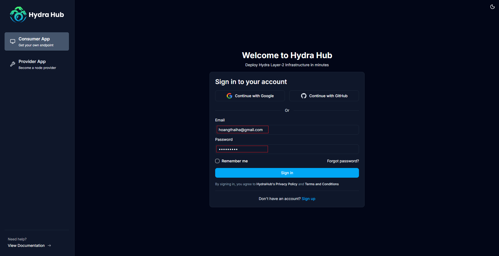

---

## 3. Admin phê duyệt tài khoản

> Bước này dành cho Admin

* Truy cập **Admin Dashboard → Account Requests**
* Xem danh sách tài khoản chờ duyệt
* Chọn **Approve** để kích hoạt tài khoản


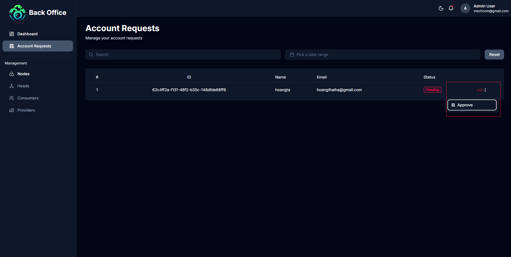

---

## 4. Quản lý Project

### 4.1 Tạo Project

* Vào menu **Projects ** ở đây bạn có thể xem được danh sách các project của bạn đã được khởi tạo
* Chọn **New Project ** mặc định khi đăng ký tài khoản sẽ được tạo một project mặc định, để có thể sử dụng nhiều project bạn sẽ cần nâng cấp tài khoản

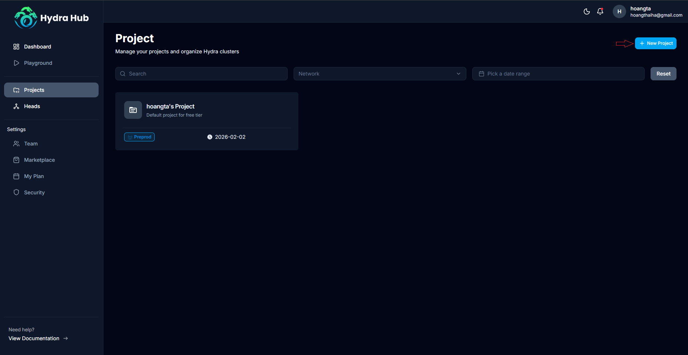
* Mỗi Project có một **Project API Key** dùng để xác thực request

### 4.2 Project API Key

* API Key được sử dụng trong header:

```
X-Api-Key: <proj_0618****54d064dea>
```

---

## 5. Hydra Head

### 5.1 Khởi tạo Head

* Trong Project, chọn **New Head**
* Cấu hình theo các bước:

  * **General**: Tên Head, môi trường (Preprod/Mainnet)
  
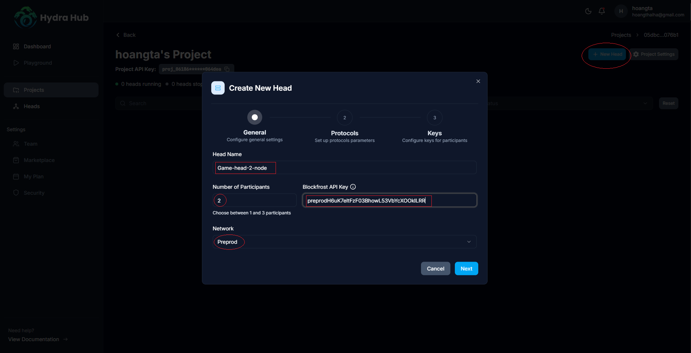
  * **Protocols**: Hydra version, contestation period, deposit period
  
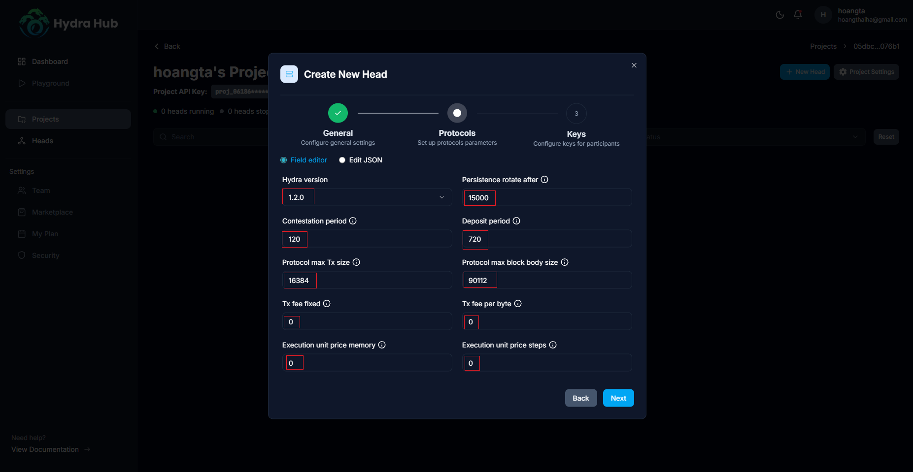
  * **Keys**: Verification keys, persistence

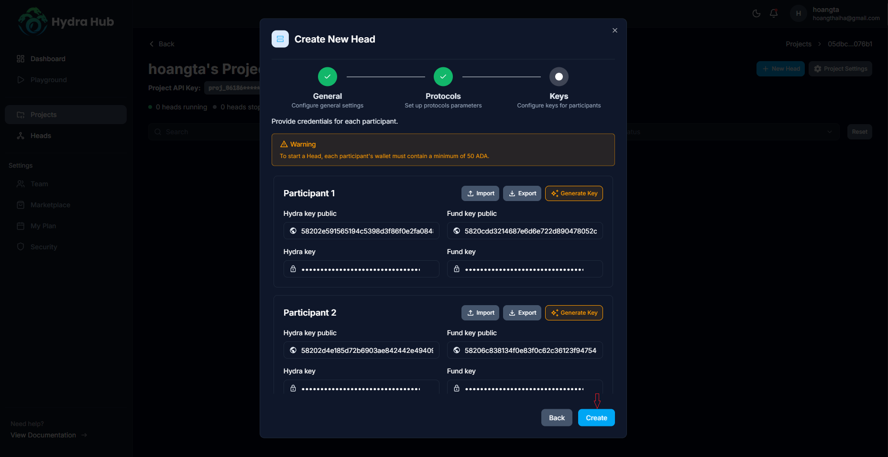
### 5.2 Trạng thái Head

* `Configured`: Đã cấu hình xong

* `Ready`: Sẵn sàng khởi động

* Running: Head đang runnning

### 5.3 Hành động khả dụng
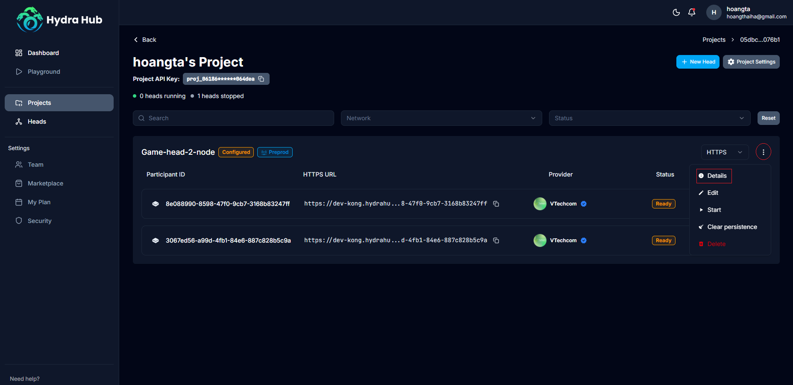

* **Details**: Xem chi tiết Head

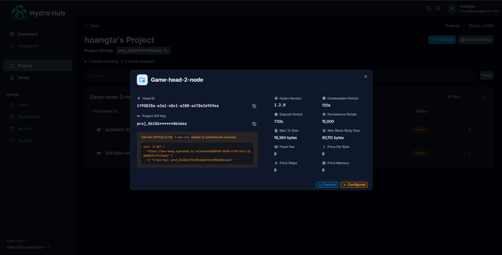

* **Edit**: Chỉnh sửa tên hiển thị của head
* **Start/Stop**: Khởi động/Tạm dừng Head
* **Restart**: Khởi động lại head
* **Delete**: Xóa Head


---

## 6. Quản lý Node / Participant

* Mỗi Head gồm nhiều Participant
* Thông tin hiển thị:

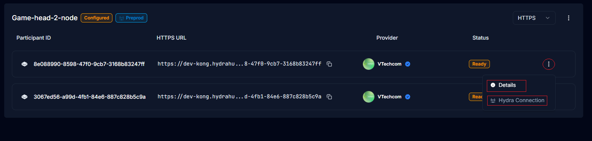
  * Participant ID
  * HTTPS URL
  * Provider
  * Status

### 6.1 Hành động khả dụng


* **Details**: Xem chi tiết Node
* **Hydra Connection**: Connect tới node hydra
---

### 6.2 Node Details

Màn hình Details hiển thị:

* Balance (ADA)
* Cardano Fund Address
* HTTP Endpoint
* WebSocket Endpoint
* Hydra Verification Key
* Fund Verification Key

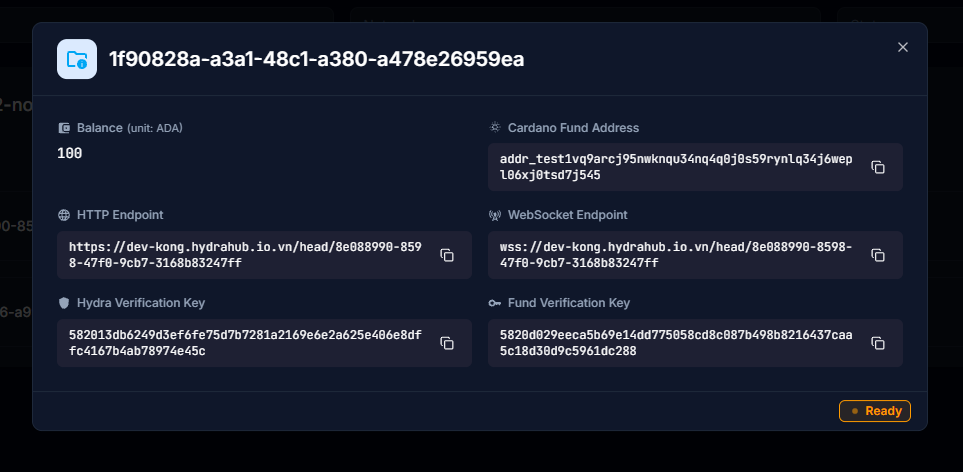
---

### 7. Hydra Connection

### 7.1 Kết nối

* Chọn **Hydra Connection**
* Hệ thống mở kết nối WebSocket realtime

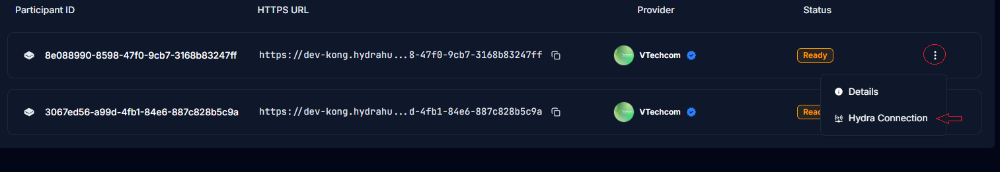

### 7.2 Trạng thái

* `Idle`
* `Initializing`
* `Connected`
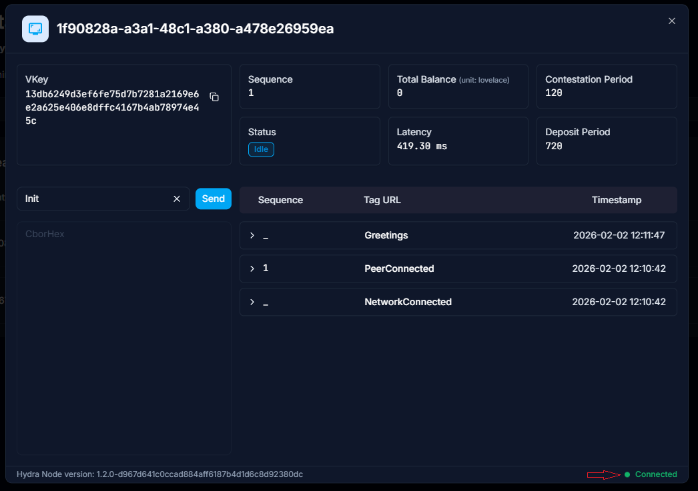

### 7.3 Event Logs

Các sự kiện phổ biến:

* `Greetings`
* `NetworkConnected`
* `PeerConnected`
* `HeadIsInitializing`
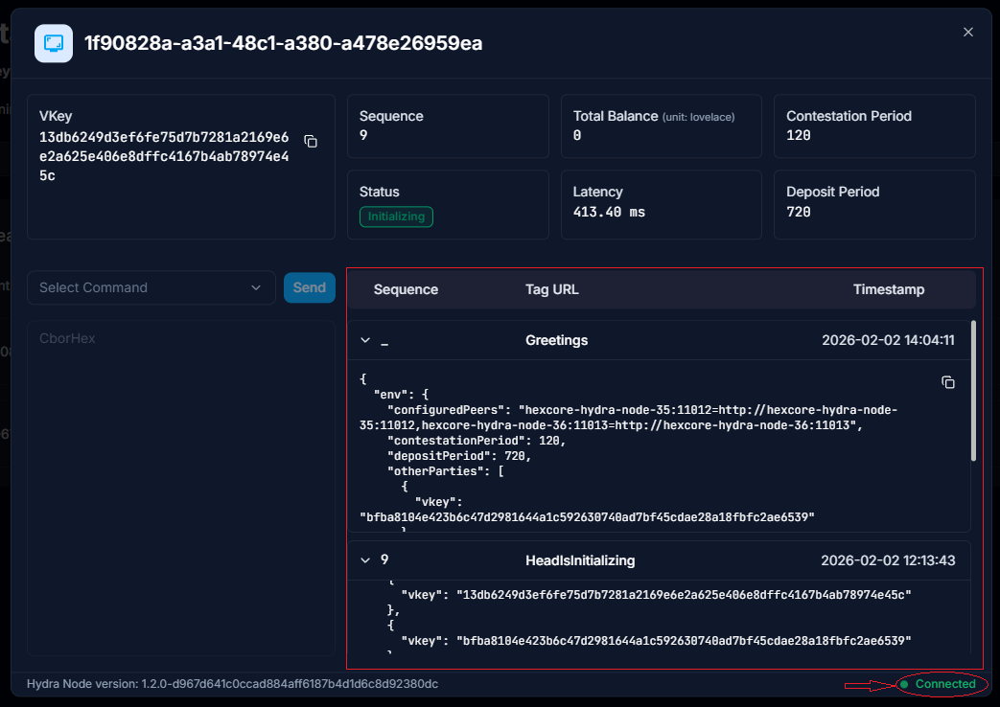

Khi góc dưới hiển thị **Connected (green)**, Head đã hoạt động thành công.

---

## 8. Lưu ý & Best Practices

* Luôn bảo mật API Key
* Chỉ Start Head khi tất cả Participant ở trạng thái Ready
* Sử dụng Preprod để test trước Mainnet

---

## 9. Hỗ trợ

* Xem **Documentation** trong Hydra Hub
* Liên hệ đội vận hành khi gặp sự cố
