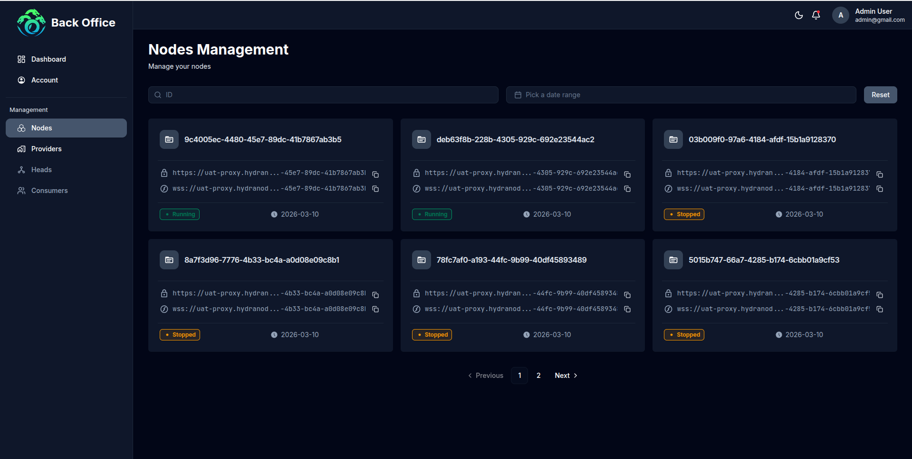
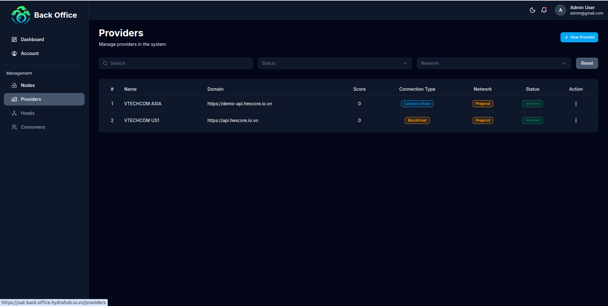
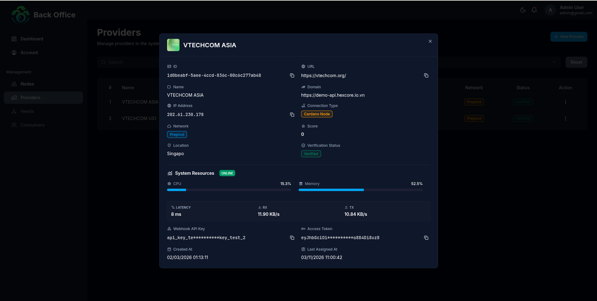
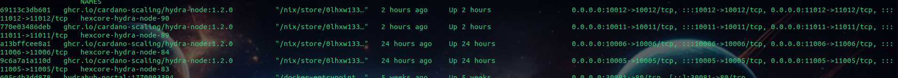

# Milestone #2 Evidence Report

**Project:** Hydra Hub (Fund14)  
**Milestone ID:** 1400060  
**Phase:** Milestone 2 - Single Provider Node Deployment & Integration  
**Submission Date:** 2026-03-12

---

## 1. Milestone Overview

This document provides evidence of successful completion of Milestone #2: Single Provider Node Deployment & Integration.

The goal of this milestone is to integrate a Hydra provider node into the Hydra Hub platform and enable developers to access the node through the Hydra Hub interface.

**All acceptance criteria defined for this milestone have been fully met.**

---

## 2. Demonstration Materials

### A. Architecture Overview

Hydra Hub does not directly operate Hydra infrastructure nodes. Instead, it allows infrastructure providers to register Hydra nodes and provide them to developers through a managed access layer.

The system architecture consists of three main components:

- **Provider Layer:** Hydra nodes operated by infrastructure providers, connected to Cardano Layer 1
- **Hydra Hub Platform:** Node registration, access allocation, monitoring, consumer authentication
- **Consumer Layer:** Developers connect their dApps through Hydra Hub

### B. Screenshots

**1. Admin Dashboard - Provider Node Management**

**2. Node Running - Uptime Validation**

The node maintained operation throughout the required minimum 24-hour continuous testing period.

**3. Provider Alert System**

The admin interface includes alerting mechanisms to notify administrators if node health deteriorates.

**4. Developer Testing - Hydra Operations**

Five developers performed complete Hydra operation tests: Opening Hydra Head, Committing UTxOs, Submitting transactions, and Executing fanout transactions.

*Developer 1 - Trinh Cuong:*

| Operation | Screenshot |
|-----------|------------|
| Head Open |  |
| UTXO Committed |  |
| Transaction |  |
| Fanout |  |

> Full screenshot evidence for all 5 developers is available in [`screenshots/dev-test/`](./screenshots/dev-test/)

---

## 3. Testing Evidence (QA Report)

**Test Environment & Credentials:**
*   **Admin URL:** `https://uat-back-office.hydrahub.io.vn`
*   **User URL (UAT):** `https://uat.hydrahub.io.vn`
*   **Admin Account:** `admin@gmail.com` / `admin@123`
*   **User Account:** `usertest@gmail.com` / `Strongpassword@123`

**Summary of Results:**
The system has passed testing for provider node integration, runtime monitoring, and developer interaction with Hydra operations.

**Test Matrix:**

| Test Category | Scope | Status |
|---------------|-------|--------|
| **Provider Node Integration** | Node registration, status management, allocation | **PASSED** |
| **Runtime Monitoring** | CPU, RAM, latency, transaction metrics via Admin Dashboard | **PASSED** |
| **Developer Testing** | Head Open, UTXO Commit, Transaction, Fanout (5 developers) | **PASSED** |
| **Uptime Validation** | 24-hour continuous node operation | **PASSED** |
| **Alert System** | Node unreachable, CPU/RAM threshold alerts | **PASSED** |

**Supporting Evidence:**
*   [Full QA Test Report Document (EN)](./qa-report/readme.md)
*   [Full QA Test Report Document (VI)](./qa-report/readme-vi.md)

**Hydra Node State Log:**

The raw Hydra node state log ([`state`](./state)) contains 8,148 events spanning ~45 hours (`2026-03-10T11:37:33Z` → `2026-03-12T08:25:29Z`), providing machine-readable proof of:
- Continuous node operation (5,802 `TickObserved` chain sync events)
- Complete Hydra lifecycle (`HeadInitialized` → `HeadOpened` → `CommittedUTxO` → `TransactionReceived` → `SnapshotConfirmed` → `HeadClosed` → `HeadFannedOut`)
- Network stability (54 chain rollbacks handled gracefully)

**Developer Feedback:**
*   [GitHub Issue - Feedback Collection](https://github.com/Vtechcom/hydra-hub-fund14-proposal/issues/2)

---

## 4. Acceptance Criteria Checklist

- [x] **1. Provider Node Integration:** Hydra provider node registered and integrated into Hydra Hub platform.
- [x] **2. Provider Registration via Admin Dashboard:** Node visible and manageable in Admin Dashboard.
- [x] **3. Runtime Monitoring & Metrics:** Admin Dashboard displays CPU, RAM, latency, and transaction metrics.
- [x] **4. Alert Configuration:** Alerting mechanisms for node health deterioration.
- [x] **5. Uptime Validation:** Node maintained 24-hour continuous operation.
- [x] **6. Developer Testing:** 5 developers successfully performed Hydra operations (Head Open, UTXO Commit, Transaction, Fanout).
- [x] **7. Developer Feedback Collection:** Feedback collected via GitHub issue.
- [x] **8. Integration Documentation:** Deployment and integration guide created.

---

## 5. Conclusion

**Milestone #2 has been successfully completed.**

The Hydra Hub platform now supports:

- ✅ Provider node registration and integration
- ✅ Node allocation to developers
- ✅ Node performance runtime monitoring and alerting
- ✅ Developer access through consumer portal
- ✅ Full Hydra operation cycle (Head Open → UTXO Commit → Transaction → Fanout)

The testing phase demonstrated that Hydra Hub can reliably connect developers with Hydra infrastructure providers. All 5 developers completed full Hydra operation cycles successfully.

This milestone establishes the foundation for expanding the Hydra Hub ecosystem with additional provider nodes and developer integrations in future milestones.

---

**Document prepared by:** Hydra Hub Development Team  
**Report Version:** 2.0  
**Last Updated:** 2026-03-12
