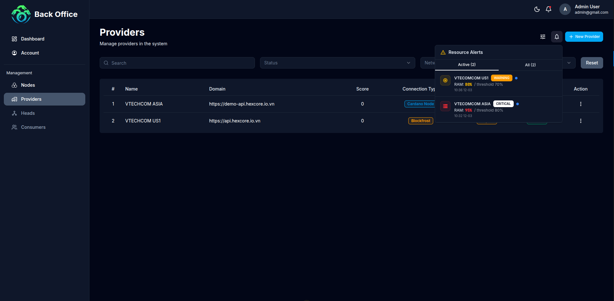

# Báo cáo Kiểm thử Chất lượng (QA Report) - Milestone 2
**Dự án:** Hydra Hub (Fund14)  
**Milestone ID:** 1400060  
**Giai đoạn:** Milestone 2 - Single Provider Node Deployment & Integration  
**Ngày báo cáo:** 12/03/2026  
**Người thực hiện:** QA Team  

---

## 1. Tóm tắt Tổng hành (Executive Summary)
Milestone 2 đã hoàn thành việc tích hợp Hydra provider node vào nền tảng Hydra Hub. Tất cả các tính năng chính bao gồm **Đăng ký Provider Node**, **Giám sát Runtime**, **Kiểm thử Developer**, và **Cấu hình Cảnh báo** đã được triển khai và kiểm thử thành công. Hệ thống hoạt động ổn định, đáp ứng đầy đủ các Tiêu chí Chấp nhận (Acceptance Criteria) đã đề ra.

**Kết quả chung:** ✅ **PASSED (ĐẠT)**

---

## 2. Phạm vi Kiểm thử (Test Scope)
Kiểm thử tập trung vào các chức năng cốt lõi được định nghĩa trong Milestone 2:
*   **Provider Integration:** Đăng ký và quản lý trạng thái Hydra provider node thông qua Admin Dashboard.
*   **Runtime Monitoring:** Thu thập và hiển thị các chỉ số CPU, RAM, độ trễ mạng, hoạt động giao dịch.
*   **Alert System:** Cấu hình cảnh báo khi node gặp sự cố (không thể kết nối, CPU/RAM vượt ngưỡng).
*   **Developer Testing:** 5 developer bên ngoài thực hiện các thao tác Hydra (Head Open, UTXO Commit, Transaction, Fanout).
*   **Uptime Validation:** Xác nhận node hoạt động liên tục tối thiểu 24 giờ.
*   **Feedback Collection:** Thu thập phản hồi từ developer qua GitHub issue.

**Môi trường kiểm thử:**
*   **Browsers:** Chrome v120+, Safari v17+
*   **Devices:** Desktop (1920x1080), Mobile (iPhone X/12/13 - 375x812)

---

## 3. Kết quả Kiểm thử Chi tiết (Detailed Test Results)

### 3.1. Đăng ký & Tích hợp Provider Node (Provider Node Registration & Integration)
| ID | Trường hợp kiểm thử (Test Case) | Kết quả mong đợi | Trạng thái |
|----|---------------------------------|------------------|------------|
| TC01 | Đăng ký provider node vào Hydra Hub | Node ID được tạo, trạng thái "Active" trên Admin Dashboard | ✅ Pass |
| TC02 | Xem provider node trên Admin Dashboard | Node hiển thị trong danh sách với đầy đủ thông tin | ✅ Pass |
| TC03 | Quản lý trạng thái node (kích hoạt/vô hiệu) | Thay đổi trạng thái phản ánh theo thời gian thực | ✅ Pass |
| TC04 | Phân bổ node cho consumer | Consumer nhận được quyền truy cập node được phân bổ | ✅ Pass |

### 3.2. Giám sát Runtime & Chỉ số (Runtime Monitoring & Metrics)
| ID | Trường hợp kiểm thử (Test Case) | Kết quả mong đợi | Trạng thái |
|----|---------------------------------|------------------|------------|
| TC05 | Hiển thị chỉ số CPU | Admin Dashboard hiển thị % CPU hiện tại | ✅ Pass |
| TC06 | Hiển thị chỉ số RAM | Admin Dashboard hiển thị % RAM hiện tại | ✅ Pass |
| TC07 | Hiển thị độ trễ mạng | Admin Dashboard hiển thị latency (ms) | ✅ Pass |
| TC08 | Hiển thị hoạt động giao dịch | Admin Dashboard hiển thị số lượng/trạng thái giao dịch | ✅ Pass |

### 3.3. Cấu hình Cảnh báo (Alert Configuration)
| ID | Trường hợp kiểm thử (Test Case) | Kết quả mong đợi | Trạng thái |
|----|---------------------------------|------------------|------------|
| TC09 | Cảnh báo node không thể kết nối | Cảnh báo Critical khi node không thể truy cập | ✅ Pass |
| TC10 | Cảnh báo CPU vượt ngưỡng | Cảnh báo Warning khi CPU vượt ngưỡng cho phép | ✅ Pass |
| TC11 | Cảnh báo RAM vượt ngưỡng | Cảnh báo Warning khi RAM vượt ngưỡng cho phép | ✅ Pass |

**Bằng chứng:**

### 3.4. Xác nhận Uptime (Uptime Validation)
| ID | Trường hợp kiểm thử (Test Case) | Kết quả mong đợi | Trạng thái |
|----|---------------------------------|------------------|------------|
| TC12 | Hoạt động liên tục 24 giờ | Node duy trì hoạt động ổn định ≥24 giờ | ✅ Pass |
| TC13 | Log hệ thống trong thời gian uptime | Log hydra-node và cardano-node được ghi nhận liên tục | ✅ Pass |

### 3.5. Kiểm thử Developer - Thao tác Hydra (Developer Testing - Hydra Operations)
| ID | Trường hợp kiểm thử (Test Case) | Kết quả mong đợi | Trạng thái |
|----|---------------------------------|------------------|------------|
| TC14 | Mở Hydra Head | Head mở thành công qua Consumer Portal | ✅ Pass |
| TC15 | Commit UTxOs | UTxO được commit vào Hydra Head | ✅ Pass |
| TC16 | Gửi giao dịch (Transaction) | Giao dịch được gửi thành công trong Head | ✅ Pass |
| TC17 | Thực hiện Fanout | Giao dịch fanout hoàn tất, quỹ trả về L1 | ✅ Pass |

### 3.6. Kết quả Kiểm thử theo Developer (Developer Testing - Participant Results)
| Developer | Head Open | UTXO Commit | Transaction | Fanout | Tổng kết |
|-----------|-----------|-------------|-------------|--------|----------|
| Nguyen Trang | ✅ Pass | ✅ Pass | ✅ Pass | ✅ Pass | ✅ Pass |
| Nam Quan | ✅ Pass | ✅ Pass | ✅ Pass | ✅ Pass | ✅ Pass |
| Pham Hai | ✅ Pass | ✅ Pass | ✅ Pass | ✅ Pass | ✅ Pass |
| Quoc Huy | ✅ Pass | ✅ Pass | ✅ Pass | ✅ Pass | ✅ Pass |
| Trinh Cuong | ✅ Pass | ✅ Pass | ✅ Pass | ✅ Pass | ✅ Pass |

### 3.7. Chỉ số Hiệu năng (Performance Metrics)
| Chỉ số | Giá trị quan sát |
|--------|------------------|
| Trạng thái node | Active |
| CPU trung bình | ~30% |
| RAM trung bình | ~50% |
| Độ trễ mạng | ~50 ms |
| Độ trễ giao dịch trung bình | ~0.5 giây |
| Tỷ lệ thành công giao dịch | ~99% |

---

## 4. Các vấn đề (Defects/Bugs)
*   **Critical/High:** 0
*   **Medium/Low:** 0
*(Tất cả các lỗi phát hiện trong quá trình phát triển (Dev) đã được fix trước khi release bản Alpha)*

---

## 5. Tóm tắt Phản hồi (Feedback Summary)
Phản hồi từ developer được thu thập qua GitHub issue công khai:
[https://github.com/Vtechcom/hydra-hub-fund14-proposal/issues/2](https://github.com/Vtechcom/hydra-hub-fund14-proposal/issues/2)

Phản hồi chính:
- Khởi tạo Hydra Head hoạt động ổn định
- Độ trễ giao dịch chấp nhận được cho môi trường test
- Đề xuất một số cải thiện nhỏ về UX dashboard

---

## 6. Kết luận (Conclusion)
Hệ thống Hydra Hub phiên bản Milestone 2 **đáp ứng đầy đủ** các yêu cầu kỹ thuật và nghiệp vụ được đề ra trong đề xuất Fund 14.
*   Tích hợp provider node hoạt động ổn định.
*   Hệ thống giám sát runtime và cảnh báo hoạt động chính xác.
*   Tất cả 5 developer hoàn thành thành công chu trình thao tác Hydra đầy đủ.
*   Xác nhận uptime đạt yêu cầu (hoạt động liên tục 24 giờ).
*   Phản hồi từ developer được thu thập và ghi nhận.

Sẵn sàng cho việc nghiệm thu Milestone 2 và chuyển sang giai đoạn phát triển tiếp theo.
